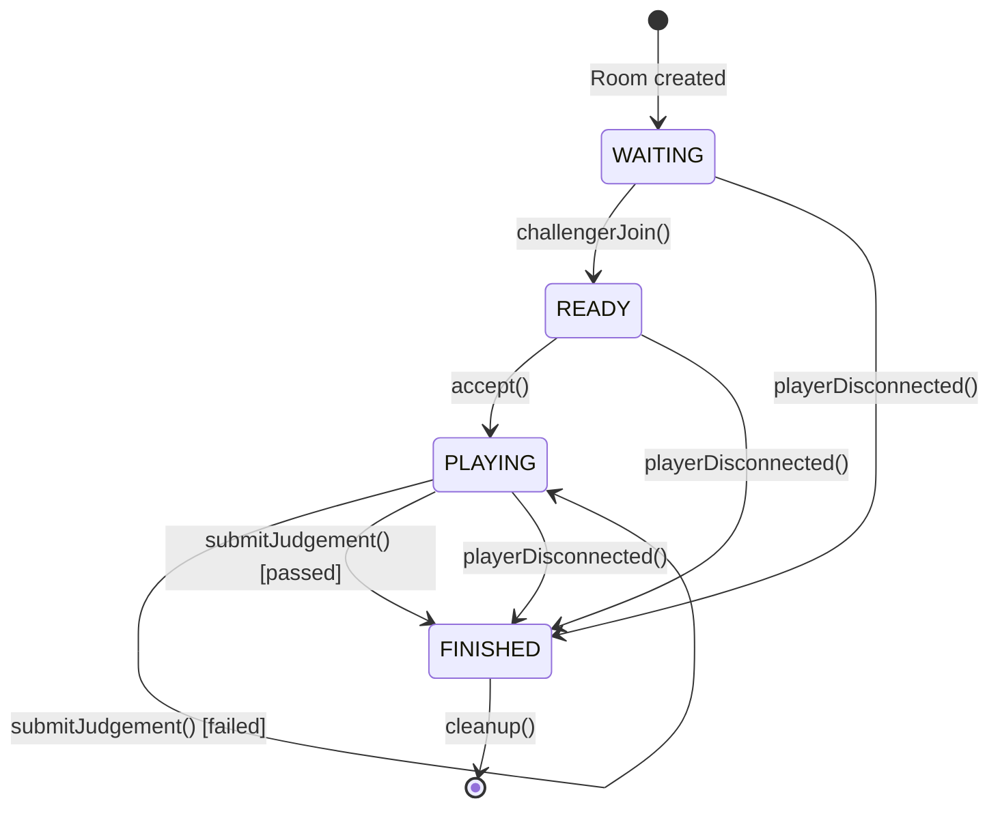

# Design Patterns Documentation — GitDojo Backend

This document explains how two software design patterns are implemented in the GitDojo backend to manage Docker container orchestration and duel session lifecycles.

---

## 1. Factory Pattern — `SandboxFactory`

### Problem

Creating a sandbox environment for a challenge involves multiple sequential steps:

1. Create a temporary directory
2. Run challenge setup commands (git init, file creation, etc.)
3. Create a Docker container with resource limits
4. Spawn a pty (pseudo-terminal) session inside the container
5. Wire terminal output to the appropriate WebSocket clients

These steps were **duplicated** across solo mode and duel mode in `server.js`, with minor variations. Adding a new mode (e.g., tutorial) would require copying the same orchestration logic again.

### Solution

The **Factory Pattern** encapsulates object creation logic behind a well-defined interface. Instead of constructing sandbox objects step-by-step in each API handler, we delegate to `SandboxFactory` methods that return fully-initialized sandbox instances.

### Implementation

**File:** [`SandboxFactory.js`](file:///c:/Users/lohah/OneDrive/Desktop/projects/GitDojo/backend/SandboxFactory.js)

#### Class Structure

```
┌─────────────────────────────────────────────────┐
│              SandboxFactory                      │
│─────────────────────────────────────────────────│
│  + createSoloSandbox(challenge) → Sandbox       │
│  + createDuelSandbox(challenge) → Sandbox       │
│  + destroySandbox(sandbox)      → void          │
│─────────────────────────────────────────────────│
│  - _createBase()                → Sandbox       │
│  - _setupChallenge(sandbox, challenge) → void   │
│  - _executeSetupCommands(dir, cmds)   → void    │
│  - _spawnPty(dir, containerId)        → pty     │
└─────────────────────────────────────────────────┘
```

#### Sandbox Object Shape

Every factory method returns an object with this consistent interface:

```js
{
  containerId:     string | null,  // Docker container ID
  ptyProcess:      object | null,  // node-pty process (terminal I/O)
  challengeDir:    string | null,  // Path to temp directory
  terminalHistory: string,         // Recorded terminal output
}
```

#### How It Works

The factory uses a **Template Method** internally — `_createBase()` is the shared first step, and each public method adds mode-specific configuration:

```js
// Solo mode — called from GET /api/challenge
soloSandbox = factory.createSoloSandbox(challenge);

// Duel mode — called from DuelSession.accept()
player.sandbox = factory.createDuelSandbox(challenge);

// Cleanup — same method for all modes
factory.destroySandbox(sandbox);
```

**Internally**, both `createSoloSandbox()` and `createDuelSandbox()` follow the same sequence:

```
_createBase()          →  Create temp dir, return empty Sandbox
    ↓
_setupChallenge()      →  Run setup commands in the dir
    ↓
docker.createContainer() → Create Docker container with resource limits
    ↓
_spawnPty()            →  Spawn pty inside container (or local fallback)
    ↓
return Sandbox         →  Fully initialized, ready to use
```

#### Before vs After

**Before (inline orchestration in server.js):**
```js
// Solo mode — 15 lines of orchestration
challengeDir = createTempDir();
setupChallengeInDir(result.challenge, challengeDir);
containerId = docker.createContainer(challengeDir);
ptyProcess = spawnPty(challengeDir, containerId);

// Duel mode — same 15 lines duplicated
player.challengeDir = createTempDir();
setupChallengeInDir(room.challenge, player.challengeDir);
player.containerId = docker.createContainer(player.challengeDir);
player.ptyProcess = spawnPty(player.challengeDir, player.containerId);
```

**After (factory delegation):**
```js
// Solo mode — one line
soloSandbox = factory.createSoloSandbox(challenge);

// Duel mode — one line
player.sandbox = factory.createDuelSandbox(challenge);
```

#### Relationship to `docker-helpers.js`

`docker-helpers.js` remains **unchanged** as the low-level Docker abstraction. `SandboxFactory` is a **higher-level orchestrator** that uses `docker-helpers` internally:

```
server.js  →  SandboxFactory  →  docker-helpers  →  Docker Engine
  (routes)    (orchestration)     (raw commands)     (containers)
```

---

## 2. State Pattern — `DuelSession`

### Problem

The duel room lifecycle has four states: `WAITING → READY → PLAYING → FINISHED`. In the original code, state was a plain string property (`room.state = 'playing'`), with **manual guards** scattered across multiple API handlers:

```js
// In /api/duel/:roomId/accept
if (room.state !== 'ready') return res.status(400)...
room.state = 'playing';

// In /api/duel/:roomId/judge
if (room.state !== 'playing') return res.status(400)...
room.state = 'finished';
```

This approach is error-prone — nothing prevents illegal state changes, and the same guard logic is duplicated across WebSocket handlers and REST endpoints.

### Solution

The **State Pattern** encapsulates state-dependent behavior into a class where each action is a **guarded transition**. The `DuelSession` class validates the current state before allowing any transition, making illegal state changes impossible.

### Implementation

**File:** [`DuelSession.js`](file:///c:/Users/lohah/OneDrive/Desktop/projects/GitDojo/backend/DuelSession.js)

#### State Machine



#### Transition Table

| Current State | Action | Guard | Next State |
|---|---|---|---|
| `WAITING` | `challengerJoin(ws, name)` | Must be in WAITING | `READY` |
| `READY` | `accept()` | Must be in READY | `PLAYING` |
| `PLAYING` | `submitJudgement(role, result)` | Must be in PLAYING, score ≥ 70 | `FINISHED` |
| `PLAYING` | `submitJudgement(role, result)` | Must be in PLAYING, score < 70 | `PLAYING` |
| any | `playerDisconnected(role)` | Must not be FINISHED | `FINISHED` |

#### Guarded Transitions

Every transition method returns a result object instead of throwing:

```js
// Return type for all transition methods:
{ ok: boolean, error?: string, ...extraData }
```

The private `_canTransition()` method checks against a whitelist:

```js
const VALID_TRANSITIONS = {
  waiting:  ['ready', 'finished'],
  ready:    ['playing', 'finished'],
  playing:  ['playing', 'finished'],
  finished: [],  // terminal state — no transitions allowed
};

_canTransition(targetState) {
  const allowed = VALID_TRANSITIONS[this.state];
  return allowed && allowed.includes(targetState);
}
```

#### How API Handlers Use It

**Before (manual state management in server.js):**
```js
app.post('/api/duel/:roomId/accept', (req, res) => {
  const room = rooms.get(req.params.roomId);
  if (!room) return res.status(404)...
  if (room.state !== 'ready') return res.status(400)...
  
  room.state = 'playing';
  
  for (const role of ['host', 'challenger']) {
    // 20+ lines of sandbox setup...
    player.challengeDir = createTempDir();
    setupChallengeInDir(room.challenge, player.challengeDir);
    player.containerId = docker.createContainer(player.challengeDir);
    player.ptyProcess = spawnPty(player.challengeDir, player.containerId);
    // ...wire pty output...
  }
  // ...notify players...
});
```

**After (delegated to DuelSession):**
```js
app.post('/api/duel/:roomId/accept', (req, res) => {
  const session = sessions.get(req.params.roomId);
  if (!session) return res.status(404)...

  // One-line guarded transition — handles state check + sandbox creation
  const result = session.accept();
  if (!result.ok) return res.status(400).json({ error: result.error });

  // Just wire output and notify
  // ...
});
```

#### DuelSession + SandboxFactory Integration

`DuelSession` owns a private `SandboxFactory` instance. When `accept()` is called (READY → PLAYING), the session uses the factory to create sandboxes:

```
session.accept()
    ↓ validates: state === READY
    ↓ 
    ├──→ factory.createDuelSandbox(challenge)  → host sandbox
    ├──→ factory.createDuelSandbox(challenge)  → challenger sandbox
    ↓
    state = PLAYING
```

On cleanup, it delegates sandbox destruction back to the factory:

```
session.cleanup()
    ├──→ factory.destroySandbox(host.sandbox)
    └──→ factory.destroySandbox(challenger.sandbox)
```

---

## Architecture After Refactoring

```
┌──────────────────────────────────────────────────────────────┐
│                        server.js                              │
│  Routes (REST API) + WebSocket handler                       │
│  - Solo: uses SandboxFactory directly                        │
│  - Duel: delegates to DuelSession                            │
└──────────────┬───────────────────────┬───────────────────────┘
               │                       │
               ▼                       ▼
┌──────────────────────┐   ┌──────────────────────────────┐
│   SandboxFactory     │   │       DuelSession             │
│   (Factory Pattern)  │   │       (State Pattern)         │
│                      │◄──│                               │
│ createSoloSandbox()  │   │ challengerJoin() WAIT→READY   │
│ createDuelSandbox()  │   │ accept()         READY→PLAY   │
│ destroySandbox()     │   │ submitJudgement() PLAY→FIN    │
│                      │   │ playerDisconnected()          │
└──────────┬───────────┘   └───────────────────────────────┘
           │
           ▼
┌──────────────────────┐
│   docker-helpers.js  │  (unchanged — low-level Docker ops)
│                      │
│ createContainer()    │
│ spawnContainerPty()  │
│ execInContainer()    │
│ destroyContainer()   │
└──────────┬───────────┘
           │
           ▼
     Docker Engine
```

## Files Summary

| File | Pattern | Role |
|---|---|---|
| `SandboxFactory.js` | Factory | Encapsulates container lifecycle creation |
| `DuelSession.js` | State | Manages duel room state machine |
| `docker-helpers.js` | — | Low-level Docker commands (unchanged) |
| `server.js` | — | Routes + WS handler, delegates to above |
